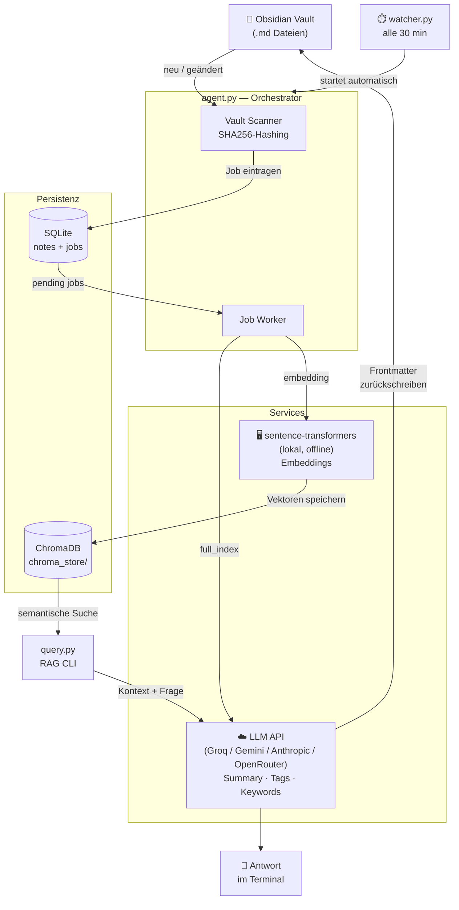

# Obsidian Automation Agent

Analysiert und verschlagwortet Obsidian-Notizen automatisch per KI, erstellt semantische Embeddings und beantwortet Fragen über den gesamten Vault (RAG). Embeddings laufen vollständig lokal — nur der LLM-Aufruf geht nach außen.

---

## Architektur



---

## Schnellstart mit Docker (empfohlen)

### 1. Repository klonen

```bash
git clone <repo-url>
cd obsidianAutomation
```

### 2. `.env` anlegen

Kopiere `.env.example` nach `.env` und trage deine Werte ein:

```env
LLM_PROVIDER=groq
GROQ_API_KEY=gsk_...          # https://console.groq.com → API Keys

HOST_VAULT_PATH=C:\Users\dein-name\Documents\ObsidianVault
                               # Windows-Pfad zu deinem Vault
```

> `VAULT_PATH` und `DB_PATH` werden durch Docker automatisch gesetzt — diese Zeilen kannst du in der `.env` weglassen oder so lassen wie sie sind.

### 3. Image bauen (einmalig, ~5 Minuten)

```bash
docker compose build
```

Das Embedding-Modell (~400 MB) wird direkt ins Image gebacken, sodass der erste Start sofort läuft.

### 4. Watcher starten (empfohlen)

```bash
docker compose up watcher -d
```

Der Watcher läuft dauerhaft im Hintergrund und indiziert den Vault automatisch alle 30 Minuten. Neue Notizen werden erkannt, sobald du sie in Obsidian gespeichert hast — ohne dass du etwas tun musst.

**Intervall anpassen** — in der `.env`:
```env
WATCH_INTERVAL_MINUTES=15
```

**Logs anzeigen:**
```bash
docker compose logs watcher -f
```

**Watcher stoppen:**
```bash
docker compose stop watcher
```

> Alternativ: `docker compose up agent` für einen einmaligen Durchlauf ohne Dauerbetrieb.

### 5. Vault abfragen

```bash
# Einzelfrage
docker compose run --rm query python query.py "Was sind meine wichtigsten Erkenntnisse zum Thema Produktivität?"

# Interaktiver Modus (mehrere Fragen hintereinander)
docker compose run --rm --profile query query
```

---

## Installation ohne Docker (Python)

### Voraussetzungen

- Python 3.11+
- API Key für einen der unterstützten Provider

### Abhängigkeiten installieren

```bash
pip install -r requirements.txt
```

### `.env` anlegen

```env
LLM_PROVIDER=groq
GROQ_API_KEY=gsk_...
DEFAULT_MODEL=llama-3.1-8b-instant
VAULT_PATH=/pfad/zu/deinem/vault
DB_PATH=obsidian_agent.db
```

### Starten

```bash
# Vault indizieren
python agent.py

# Vault abfragen
python query.py "Deine Frage"
python query.py              # interaktiver Modus
```

---

## LLM-Provider

| Provider | `LLM_PROVIDER` | Empfohlenes Modell | Kosten |
|---|---|---|---|
| **Groq** | `groq` | `llama-3.1-8b-instant` | kostenlos (30 req/min) |
| **Groq** | `groq` | `llama-3.3-70b-versatile` | kostenlos, langsamer |
| **Google Gemini** | `gemini` | `gemini-2.0-flash` | kostenlos (1500 req/Tag) |
| **Anthropic** | `anthropic` | `claude-haiku-4-5` | ~€1–2/Monat |
| **OpenRouter** | `openrouter` | `meta-llama/llama-3.1-8b-instruct` | ~$0/Monat |

API Keys:
- Groq: [console.groq.com](https://console.groq.com)
- Gemini: [aistudio.google.com](https://aistudio.google.com)
- Anthropic: [console.anthropic.com](https://console.anthropic.com)
- OpenRouter: [openrouter.ai](https://openrouter.ai)

---

## Was der Agent macht

| Feature | Beschreibung |
|---|---|
| **Auto-Tagging** | Analysiert neue/geänderte Notizen, schreibt `ai_summary`, `ai_tags`, `ai_keywords` automatisch in den YAML-Frontmatter |
| **Embeddings** | Zerlegt Notizen in Chunks, erstellt lokale Vektoren offline (~400 MB Modell, einmalig gecacht) |
| **Auto-Linking** | Findet semantisch ähnliche Notizen (Cosine-Similarity ≥ 0.75), schreibt `[[Wiki-Links]]` in den Body (`## Related Notes`) und ins Frontmatter (`ai_related_notes`) — Obsidian zeigt sie automatisch im Graph |
| **RAG-Query** | Beantwortet Fragen über den gesamten Vault via `query.py` — semantische Suche + KI-Synthese |
| **Verarbeitungsreihenfolge** | Pro Notiz: `full_index` → Embeddings → `auto_link` — alles automatisch in einem Durchlauf |
| **Manuelle Änderungen** | Eigene `tags:` und `[[Links]]` im Body bleiben erhalten; nur `ai_*`-Felder werden vom Agent verwaltet |
| **Änderungserkennung** | SHA256-Hashing verhindert unnötige KI-Aufrufe bei unveränderten Notizen |
| **Rate-Limit-Retry** | Wartet automatisch bei 429-Fehlern und wiederholt den Aufruf mit exponentiellem Backoff |
| **Auto-Watcher** | Läuft dauerhaft im Hintergrund, indiziert neue Notizen automatisch im einstellbaren Intervall |

---

## Projektstruktur

```
agent.py                  Orchestrator: Vault-Scan + Job-Worker
watcher.py                Dauerbetrieb: startet agent.py im konfigurierbaren Intervall
query.py                  RAG-CLI: Vault interaktiv abfragen
core.py                   Provider-Dispatch, DB-Verbindung, call_ai()
config.py                 .env laden, Provider-Validierung
utils.py                  Markdown-Parsing, SHA256-Hashing
services/
  embedding_service.py    Lokale Embeddings + ChromaDB
  rag_service.py          RAG-Pipeline, Ähnlichkeitssuche
Dockerfile                Container-Build
docker-compose.yml        agent / watcher / query als Services
requirements.txt          Python-Abhängigkeiten
```

---

## Tests

```bash
python -m unittest test_utils.py
```
